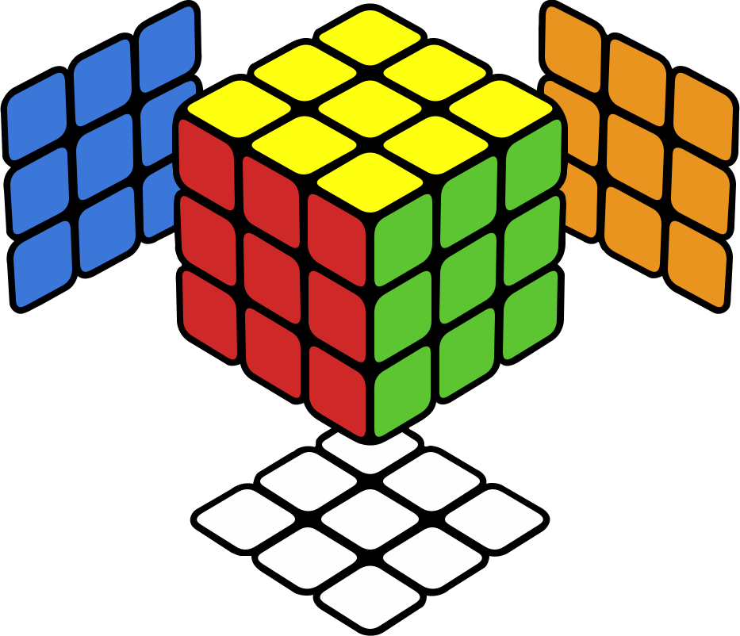

# Cubie

An extremely fast 3x3x3 Rubik's cube library for Rust.

The entire cube state fits in **16 bytes** — two `u64`s — using bit-packed
permutation maps. Every type is `Copy`. Cube operations are group
multiplications, so you just use `*` to combine states, `.inverse()` to
reverse them, and `Cube::default()` is the solved identity element.

<p align="center"></p>

## Usage

```rust
use cubie::{Cube, Move::*, CubeDisplay};

// Apply moves with *
let cube = Cube::default() * R1 * U1 * R3 * U1 * R1 * U2 * R3;

// It's a group — inverse works how you'd expect
assert_eq!(cube * cube.inverse(), Cube::default());

// Build from an array of moves
let checkerboard = Cube::from([E2, M2, S2]);

// Render to terminal or SVG
println!("{}", CubeDisplay::vt(&checkerboard.into()));
std::fs::write("cube.svg", CubeDisplay::svg(&checkerboard.into()).to_string())
    .expect("failed to write SVG");

// Yes, really 16 bytes
assert_eq!(std::mem::size_of::<Cube>(), 16);
```

All 54 standard moves are supported — outer face (`R1`, `U3`, ...), wide
(`Rw1`, `Uw2`, ...), slice (`M1`, `E2`, `S3`), and whole-cube rotations
(`X1`, `Y2`, `Z3`). The suffix is the angle: `1` = clockwise, `2` = half
turn, `3` = counter-clockwise.

You can also parse from standard notation:

```rust
let mv: Move = "R'".parse().unwrap();  // counter-clockwise
let mv: Move = "U2".parse().unwrap();  // half turn
let mv: Move = "Fw".parse().unwrap();  // wide clockwise
```

## Primitives

`Cube` is the main type — 16 bytes holding corners, edges, and center
orientation. If you don't care about whole-cube rotations there's
`FixedCentersCube` which treats centers as fixed.

Under the hood, the state is split into `CornerMap` (8 bytes),
`EdgeMap` (8 bytes), and `CenterMap` (8 bytes) — bit-packed permutation
maps you can also work with directly. `TileMap` gives you a 54-tile
representation for when you need to think in terms of stickers rather than
pieces.

`has_solution()` tells you if a state is reachable, and `validate()` checks
structural integrity.
